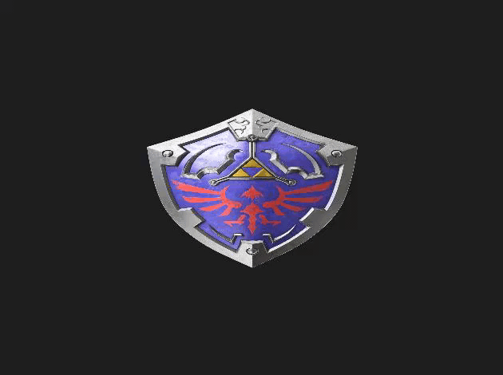
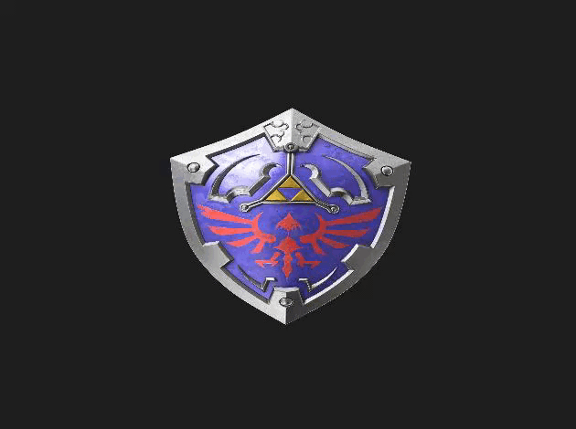

# Object Handler

**Object Handler** is a 3D model viewer written in C++.

   
  
   

---

### Features

##### Main

* Supported object files: ASSIMP supported object file extensions (obj, fbx, 3ds, ...)
* Modern OpenGL shading (VAO, VBO, EBO, ...)
* Phong shading
* Shading with GLSL
* Normal vectors being generated automatically (flag aiProcess_GenNormals)
* All polygons as triangles (flag aiProcess_Triangulate)

##### Camera

* Camera rotation: Pitch constraint or Pitch constraint break (default)
* 7 camera positions: front, right, back, left, top, bottom, diagonal
* Camera controls: move, rotate, zoom, change camera view

##### Control

* Devices: Mouse, Keyboard, Joystick (including more than one at the same time; e.g., mouse + keyboard, or joystick 1 + joystick 2 + keyboard, ...)
* Smooth sensibility (SDL pollEvents and pumpEvents)
* Sensibility for mouse, keyboard and joystick
* View modes: fill (textured) by default, line (wireframe) or point (vertices)
* Themes: dark by default or light

##### Advanced

* Working with Release x64, Release x86, Debug x64, Debug x86
* Debug opens a console window with util informations for debugging, including meshes/triangles/vertices count, action logs, and so on
* Code working with warning level 4
* Ready to go project: 1. Clone/Download this repository, 2. Compile with VS14 (2015), 3. Run

---

### Technologies

* **OpenGL** 3.3 (_GLEW_ 2.0.0)
* **SDL** 2
* **SOIL** 2
* **GLM** 0.9.9.5
* **Assimp** 4.1.0
* **Microsoft Visual Studio 14.0 (2015)**

---

### Shortcuts

 
<table style="width:100%">
  <tr>
    <th>
<b>Device</b>
</th>
    <th>
<b>Shortcut</b>
</th>
    <th>
<b>Action</b>
</th>
  </tr>
  <tr>
    <td rowspan="6">
<b><i>Mouse</i></b>
</td>
    <td>
<b>Ctrl</b> + Hold <i>Left</i> Button + [<i>Move</i>]
</td>
    <td>
<i>Increase/Decrease</i> camera <i>zoom</i>
</td>
  </tr>
  <tr>
    <td>
<b>Shift</b> + Hold <i>Left</i> Button + [<i>Move</i>]
</td>
    <td>
<i>Move</i> camera
</td>
  </tr>
  <tr>
    <td>
Hold <i>Left</i> Button + [<i>Move</i>]
</td>
    <td>
<i>Rotate</i> camera
</td>
  </tr>
  <tr>
    <td>
Hold <i>Middle</i> Button + [<i>Move</i>]
</td>
    <td>
<i>Move</i> camera
</td>
  </tr>
  <tr>
    <td>
<b>Alt</b> + Hold <i>Right</i> Button + [<i>Move</i>]
</td>
    <td>
<i>Increase/Decrease</i> camera <i>zoom</i>
</td>
  </tr>
  <tr>
    <td>
[<i>Wheel Slide</i>]
</td>
    <td>
<i>Increase/Decrease</i> camera <i>zoom</i>
</td>
  </tr>
  <tr>
    <td rowspan="42">
<b><i>Keyboard</i></b>
</td>
    <td>
<b>Ctrl</b> + [<i>Arrow</i>]
</td>
    <td>
<i>Increase/Decrease</i> camera <i>zoom</i>
</td>
  </tr>
  <tr>
    <td>
<b>Shift</b> + [<i>Arrow</i>]
</td>
    <td>
<i>Move</i> camera
</td>
  </tr>
  <tr>
    <td>
[<i>Arrow</i>]
</td>
    <td>
<i>Rotate</i> camera
</td>
  </tr>
  <tr>
    <td>
<i>W</i> | <i>A</i> | <i>S</i> | <i>D</i>
</td>
    <td>
<i>Move</i> camera
</td>
  </tr>
  <tr>
    <td>
<b>Ctrl</b> + <i>K</i>
</td>
    <td>
<i>Next camera</i>
</td>
  </tr>
  <tr>
    <td>
<b>Ctrl</b> + <i>M</i>
</td>
    <td>
<i>Next view mode</i>
</td>
  </tr>
  <tr>
    <td>
<b>Ctrl</b> + <i>T</i>
</td>
    <td>
<i>Next</i> application <i>theme</i>
</td>
  </tr>
  <tr>
    <td>
<b>Shift</b> + <i>1</i>
</td>
    <td>
<i>Increase mouse</i> camera <i>move</i> sensitivity
</td>
  </tr>
  <tr>
    <td>
<b>Shift</b> + <i>2</i>
</td>
    <td>
<i>Increase mouse</i> camera <i>rotate</i> sensitivity
</td>
  </tr>
  <tr>
    <td>
<b>Shift</b> + <i>3</i>
</td>
    <td>
<i>Increase mouse</i> camera <i>zoom</i> sensitivity
</td>
  </tr>
  <tr>
    <td>
<b>Shift</b> + <i>4</i>
</td>
    <td>
<i>Increase keyboard</i> camera <i>move</i> sensitivity
</td>
  </tr>
  <tr>
    <td>
<b>Shift</b> + <i>5</i>
</td>
    <td>
<i>Increase keyboard</i> camera <i>rotate</i> sensitivity
</td>
  </tr>
  <tr>
    <td>
<b>Shift</b> + <i>6</i>
</td>
    <td>
<i>Increase keyboard</i> camera <i>zoom</i> sensitivity
</td>
  </tr>
  <tr>
    <td>
<b>Shift</b> + <i>7</i>
</td>
    <td>
<i>Increase joystick</i> camera <i>move</i> sensitivity
</td>
  </tr>
  <tr>
    <td>
<b>Shift</b> + <i>8</i>
</td>
    <td>
<i>Increase joystick</i> camera <i>rotate</i> sensitivity
</td>
  </tr>
  <tr>
    <td>
<b>Shift</b> + <i>9</i>
</td>
    <td>
<i>Increase joystick</i> camera <i>zoom</i> sensitivity
</td>
  </tr>
  <tr>
    <td>
<b>Alt</b> + <i>1</i>
</td>
    <td>
<i>Decrease mouse</i> camera <i>move</i> sensitivity
</td>
  </tr>
  <tr>
    <td>
<b>Alt</b> + <i>2</i>
</td>
    <td>
<i>Decrease mouse</i> camera <i>rotate</i> sensitivity
</td>
  </tr>
  <tr>
    <td>
<b>Alt</b> + <i>3</i>
</td>
    <td>
<i>Decrease mouse</i> camera <i>zoom</i> sensitivity
</td>
  </tr>
  <tr>
    <td>
<b>Alt</b> + <i>4</i>
</td>
    <td>
<i>Decrease keyboard</i> camera <i>move</i> sensitivity
</td>
  </tr>
  <tr>
    <td>
<b>Alt</b> + <i>5</i>
</td>
    <td>
<i>Decrease keyboard</i> camera <i>rotate</i> sensitivity
</td>
  </tr>
  <tr>
    <td>
<b>Alt</b> + <i>6</i>
</td>
    <td>
<i>Decrease keyboard</i> camera <i>zoom</i> sensitivity
</td>
  </tr>
  <tr>
    <td>
<b>Alt</b> + <i>7</i>
</td>
    <td>
<i>Decrease joystick</i> camera <i>move</i> sensitivity
</td>
  </tr>
  <tr>
    <td>
<b>Alt</b> + <i>8</i>
</td>
    <td>
<i>Decrease joystick</i> camera <i>rotate</i> sensitivity
</td>
  </tr>
  <tr>
    <td>
<b>Alt</b> + <i>9</i>
</td>
    <td>
<i>Decrease joystick</i> camera <i>zoom</i> sensitivity
</td>
  </tr>
  <tr>
    <td>
<b>Ctrl</b> + <i>1</i>
</td>
    <td>
<i>Reset mouse</i> camera <i>move</i> sensitivity to default value
</td>
  </tr>
  <tr>
    <td>
<b>Ctrl</b> + <i>2</i>
</td>
    <td>
<i>Reset mouse</i> camera <i>rotate</i> sensitivity to default value
</td>
  </tr>
  <tr>
    <td>
<b>Ctrl</b> + <i>3</i>
</td>
    <td>
<i>Reset mouse</i> camera <i>zoom</i> sensitivity to default value
</td>
  </tr>
  <tr>
    <td>
<b>Ctrl</b> + <i>4</i>
</td>
    <td>
<i>Reset keyboard</i> camera <i>move</i> sensitivity to default value
</td>
  </tr>
  <tr>
    <td>
<b>Ctrl</b> + <i>5</i>
</td>
    <td>
<i>Reset keyboard</i> camera <i>rotate</i> sensitivity to default value
</td>
  </tr>
  <tr>
    <td>
<b>Ctrl</b> + <i>6</i>
</td>
    <td>
<i>Reset keyboard</i> camera <i>zoom</i> sensitivity to default value
</td>
  </tr>
  <tr>
    <td>
<b>Ctrl</b> + <i>7</i>
</td>
    <td>
<i>Reset joystick</i> camera <i>move</i> sensitivity to default value
</td>
  </tr>
  <tr>
    <td>
<b>Ctrl</b> + <i>8</i>
</td>
    <td>
<i>Reset joystick</i> camera <i>rotate</i> sensitivity to default value
</td>
  </tr>
  <tr>
    <td>
<b>Ctrl</b> + <i>9</i>
</td>
    <td>
<i>Reset joystick</i> camera <i>zoom</i> sensitivity to default value
</td>
  </tr>
  <tr>
    <td>
[<i>Keypad Num 8</i>]
</td>
    <td>
Set to <i>front camera</i>
</td>
  </tr>
  <tr>
    <td>
[<i>Keypad Num 4</i>]
</td>
    <td>
Set to <i>right camera</i>
</td>
  </tr>
  <tr>
    <td>
[<i>Keypad Num 2</i>]
</td>
    <td>
Set to <i>back camera</i>
</td>
  </tr>
  <tr>
    <td>
[<i>Keypad Num 6</i>]
</td>
    <td>
Set to <i>left camera</i>
</td>
  </tr>
  <tr>
    <td>
[<i>Keypad - (minus)</i>]
</td>
    <td>
Set to <i>bottom camera</i>
</td>
  </tr>
  <tr>
    <td>
[<i>Keypad + (plus)</i>]
</td>
    <td>
Set to <i>top camera</i>
</td>
  </tr>
  <tr>
    <td>
[<i>Keypad / (divide)</i>]
</td>
    <td>
Set to <i>diagonal camera</i>
</td>
  </tr>
  <tr>
    <td>
[<i>Keypad * (multiply)</i>]
</td>
    <td>
<i>Next camera</i>
</td>
  </tr>
  <tr>
    <td rowspan="15">
<b><i>Joystick</i></b> (<i>Sony Wireless Joystick Dualshock 4 Model CUH-ZCT2U</i>)
</td>
    <td>
[<i>Cross Direction</i>]
</td>
    <td>
<i>Move</i> camera
</td>
  </tr>
  <tr>
    <td>
[<i>Ball 1 Slide</i>]
</td>
    <td>
<i>Move</i> camera
</td>
  </tr>
  <tr>
    <td>
[<i>Ball 2 Slide</i>]
</td>
    <td>
<i>Rotate</i> camera
</td>
  </tr>
  <tr>
    <td>
[<i>Ball 1 Button</i>]
</td>
    <td>
<i>Next</i> application <i>theme</i>
</td>
  </tr>
  <tr>
    <td>
[<i>Ball 2 Button</i>]
</td>
    <td>
<i>Next view mode</i>
</td>
  </tr>
  <tr>
    <td>
[<i>X Button</i>]
</td>
    <td>
Set to <i>back camera</i>
</td>
  </tr>
  <tr>
    <td>
[<i>O Button</i>]
</td>
    <td>
Set to <i>left camera</i>
</td>
  </tr>
  <tr>
    <td>
[<i>Square Button</i>]
</td>
    <td>
Set to <i>right camera</i>
</td>
  </tr>
  <tr>
    <td>
[<i>Triangle Button</i>]
</td>
    <td>
Set to <i>front camera</i>
</td>
  </tr>
  <tr>
    <td>
[<i>L1 Button</i>]
</td>
    <td>
Set to <i>top camera</i>
</td>
  </tr>
  <tr>
    <td>
[<i>R1 Button</i>]
</td>
    <td>
Set to <i>bottom camera</i>
</td>
  </tr>
  <tr>
    <td>
[<i>L2 Button</i>]
</td>
    <td>
<i>Decrease</i> camera <i>zoom</i>
</td>
  </tr>
  <tr>
    <td>
[<i>R2 Button</i>]
</td>
    <td>
<i>Increase</i> camera <i>zoom</i>
</td>
  </tr>
  <tr>
    <td>
[<i>Start</i>]
</td>
    <td>
<i>Next camera</i>
</td>
  </tr>
  <tr>
    <td>
[<i>Select</i>]
</td>
    <td>
Set to <i>diagonal camera</i>
</td>
  </tr>
</table>
 

---

### Progress showoff

   
  
   
   
  
   
   
  
   
   
  
   
   
  
   
   
  
   
   
  
   
   
  
   
   
  
   
   
  
   
   
  
   
   
  
   
   
  
   
   
  
   
   
  
   
   
  
   
   
  
   
   
  
   
   
  
   
   
  
   
   
  
   
   
  
   
   
  
   
   
  
   
   
  
   
   
  
   
   
  
   
   
  
   
   
  
   
   
  
   
   
  
   
   
  
   
   
  
   
   
  
   
   
  
   
   
  
   
   
  
   
   
  
   
   
  
   
   
  
   
   
  
   
   
  
   
   
  
   
   
  
   
   
  
   
   
  
   
   
  
   
   
  
   
   
  
   
   
  
   
   
  
   
   
  
   
   
  
   

---

### To update

- Grid
